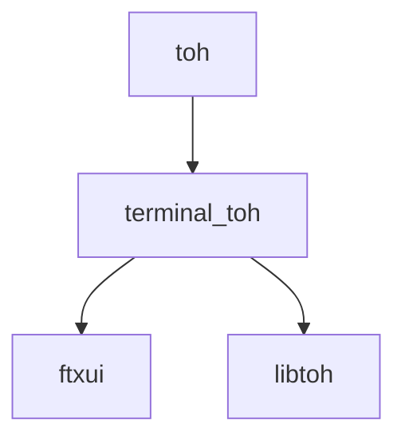

# FTowerX

An implementation of the Tower of Hanoi game, following best practices.

This is a cross-platform, lightweight, terminal-based implementation of the Tower
of Hanoi, featuring automated testing, coverage reports, packaging, and more. It
also includes generated library files that you can link to create custom user
interfaces or extend the current implementation with ease.

<p align="center"></img></p>

1. [Before You Begin](#before-you-begin)
2. [Demos](#demos)
3. [Executable and Library](#executable-and-library)
4. [Installation and Packaging](#installation-and-packaging)
5. [Tests and Coverage Reports](#tests-and-coverage-reports)
6. [Documentation](#documentation)
7. [Extending](#extending)
8. [Internationalization](#internationalization)

## Before You Begin

This project uses the [SeeMake](https://github.com/MhmRhm/SeeMake) template. To
build it on either Windows or Linux, you need to install the required packages
and software first. For Linux instructions, see
[here](https://github.com/MhmRhm/SeeMake?tab=readme-ov-file#setting-up-linux),
and for Windows setup, follow
[these](https://github.com/MhmRhm/SeeMake?tab=readme-ov-file#setting-up-windows)
instructions.

After installing the dependencies, use the following commands to build all the
artifacts, run tests, and create installers:

```bash
# On Linux
cmake --workflow --preset linux-default-release

# On Windows
cmake --workflow --preset windows-clang-release
# or
cmake --workflow --preset windows-default-release
```

You should see the following message after the build:

> 100% tests passed, 0 tests failed out of 21

## Demos

The following demos have been added to showcase the main features of FTXUI:

- **Screen**: Demonstrates how to define custom-sized screens and manipulate
characters at specific positions. It also shows how FTXUI handles screen
redrawing.
- **Elements**: Places a single UI element on a screen, illustrating the
relationship between UI elements and screens, and demonstrating FTXUI's syntax
for manipulating and customizing elements.
- **Components**: Shows interactive elements that users can engage with. This
demo demonstrates how to use UI elements alongside other components.
- **Events**: Demonstrates how event handling is managed in FTXUI.
- **Loop**: Showcases how to implement a custom loop that redraws components in
the terminal during that loop.

## Executable and Library

The following diagram illustrates the produced artifacts and their dependency
relationships:



`toh`: The game executable. It uses the model (from `libtoh`), view, and
controller (from `terminal_toh`) to run the game.

`terminal_toh` serves as the view and controller for the game, implemented in a
terminal user interface. Another developer could create `qt_toh` to implement the
user interface using Qt, linking it to `libtoh`.

`ftxui` is the library used for creating terminal views and handling user
interactions.

`libtoh` contains the game logic for the Tower of Hanoi.

## Installation and Packaging

On Linux, you should also see the following message indicating that the
installation package was successfully created:

> CPack: - package: /repos/FTowerX-build-linux-default-release/package-linux-deb/FTowerX-0.0.0-Linux.deb generated.

On Windows, the following success message will appear:

> CPack: - package: C:/Users/Mohammad Rahimi/Documents/FTowerX-build-windows-clang-release/package-windows-nsis/FTowerX-0.0.0-win64.exe generated.

You can use the generated installers to install the game, or use CMake to install
it:

```bash
cmake --install <build-directory> --prefix <installation-directory>
```

This is how your `installation-directory` will look:

```bash
tree ../installation-directory/

# ../installation-directory/
# ├── bin
# │   └── toh
# ├── include
# │   └── toh
# │       └── toh_model.h
# └── lib
#     ├── libtoh.a
#     ├── libtoh.so
#     └── toh
#         └── cmake
#             ├── TohConfig.cmake
#             ├── TohLibrary.cmake
#             └── TohLibrary-release.cmake
#
# 7 directories, 7 files
```

## Tests and Coverage Reports

During the build process, tests will run automatically. To generate coverage
reports, run these commands:

```bash
# On Linux
# For the library
cmake --build --preset linux-default-debug --target coverage-google_test_libtoh
# For the executable
cmake --build --preset linux-default-debug --target coverage-google_test_toh

# On Windows
# For the library
cmake --build --preset windows-clang-debug --target coverage-google_test_libtoh
# For the executable
cmake --build --preset windows-clang-debug --target coverage-google_test_toh
```

You should see the coverage output in the terminal:

> Overall coverage rate:  
lines......: 91.4% (32 of 35 lines)  
functions......: 75.0% (6 of 8 functions)  

Coverage reports are also available in HTML format. Navigate to the report
subdirectory in the build directory and run the following command:

```bash
python -m http.server <port-number>
```

Python will serve the report in your browser, or you can simply open the
`index.html` file in your browser.

<p align="center"></img></p>

## Documentation

Doxygen documentation can also be generated similarly to the coverage reports:

```bash
# On Linux
# For the library
cmake --build --preset linux-default-release --target doxygen-libtoh_static
# For the executable
cmake --build --preset linux-default-release --target doxygen-terminal_toh_static

# On Windows
# For the library
cmake --build --preset windows-clang-release --target doxygen-libtoh_static
# For the executable
cmake --build --preset windows-clang-release --target doxygen-terminal_toh_static
```

<p align="center"></img></p>

## Extending

You can link your projects to this one by following these steps:

1. Use CMake's FetchContent to retrieve this project. Your `CMakeLists.txt` file
might look like this:

```cmake
cmake_minimum_required(VERSION 3.30.0)
project(Extension VERSION 0.0.0 LANGUAGES CXX)

include(FetchContent)
FetchContent_Declare(Toh
    GIT_TAG main
    GIT_REPOSITORY https://github.com/MhmRhm/CppMeetupSep24.git
)
FetchContent_MakeAvailable(Toh)

add_executable(extension main.cpp)
target_link_libraries(extension PRIVATE libtoh_shared precompiled)
```

2. Create a `.cpp` file containing the `main` function:

```cpp
#include <iostream>
#include <format>
#include "libtoh/toh_model.h"

int main() {
  using Play = std::vector<toh::Position>;

  toh::Game game{10};
  Play plays{};
  solveToh(plays, 10, toh::Left, toh::Middle, toh::Right);

  std::cout << std::format("game.isFinished() = {}", game.isFinished())
            << std::endl;

  for (auto &&play : plays) {
    game.select(play);
  }

  std::cout << std::format("game.isFinished() = {}", game.isFinished())
            << std::endl;
}
```

3. To simplify things, copy the `CMakePresets.json` file from this project into
yours. Then run the build command:

```bash
cmake --workflow --preset linux-default-debug
```

Now, you should be able to run your program:

> game.isFinished() = false  
game.isFinished() = true

## Internationalization

On Linux, you can use `gettext` along with `std::locale`'s message facet to
provide internationalization support. For more details, see
[here](https://github.com/MhmRhm/cpplab/tree/main/locale).

To add support for internationalization, run the following commands:

```bash
sudo apt-get install gettext
xgettext --extract-all --c++ --output=terminal_toh.pot ./src/toh/terminal_toh.cpp
cp terminal_toh.pot terminal_toh.po

# Add translations
vim terminal_toh.po

msgfmt --check --output-file=terminal_toh.mo terminal_toh.po

# Use the correct <language>
sudo cp terminal_toh.mo /usr/share/locale/<language>/LC_MESSAGES/
```
You should add the `.pot` file to version control to ensure the translation
template is tracked and readily available for translators.

Afterwards, change your locale with the following commands:

```bash
# Generate locale
sudo locale-gen ms_MY.UTF-8

# Change locale
export LC_ALL=ms_MY.UTF-8
export LANG=ms_MY.UTF-8

# Check the change
locale
```

Now, if you run the application in the same terminal, you will see the translated text.
